# High-Level Design (HLD) — Campus Parking Management System

> **Project:** Campus Parking Management System
> **Version:** 1.0.0
> **Stack:** Spring Boot 3.2.5 · Java 17 · H2 · JWT · Vanilla JS SPA

---

## Table of Contents

1. [Introduction](#1-introduction)
2. [Architecture Overview](#2-architecture-overview)
3. [Technology Stack](#3-technology-stack)
4. [Module Decomposition](#4-module-decomposition)
5. [Data Model](#5-data-model)
6. [API Design](#6-api-design)
7. [Security Architecture](#7-security-architecture)
8. [Frontend Architecture](#8-frontend-architecture)
9. [Key Flows](#9-key-flows)
10. [Deployment View](#10-deployment-view)
11. [Non-Functional Characteristics](#11-non-functional-characteristics)

---

## 1. Introduction

### 1.1 Purpose

The Campus Parking Management System digitizes and streamlines parking operations on a university campus. It enables students and faculty to reserve parking slots online, security staff to verify occupancy via QR codes, and administrators to manage zones, monitor usage analytics, and review audit trails.

### 1.2 Scope

- Online parking slot reservation with QR-code-based check-in/checkout
- Three user roles: **User**, **Security Staff**, **Admin**
- Real-time zone and slot availability tracking
- Automated reservation expiry with scheduled notifications
- Admin dashboard with usage statistics, reports, and audit logging

---

## 2. Architecture Overview

The system follows a **monolithic layered MVC architecture** where the Spring Boot backend serves both the REST API and the static frontend SPA from a single deployable JAR.

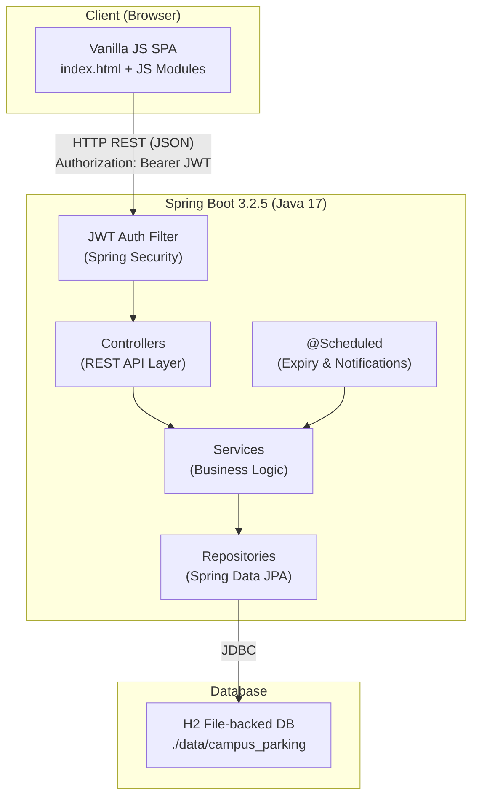

---

## 3. Technology Stack

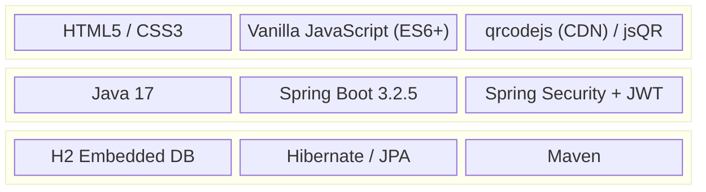

| Layer | Technology | Purpose |
|-------|-----------|---------|
| Language | Java 17 | Backend application logic |
| Framework | Spring Boot 3.2.5 | Web, Data JPA, Security, Validation |
| ORM | Hibernate (Spring Data JPA) | Object-relational mapping |
| Database | H2 (file-backed, AUTO_SERVER) | Persistent embedded storage |
| Auth | JJWT 0.12.5 + BCrypt | Token-based stateless authentication |
| Frontend | Vanilla JS SPA | Single-page application with DOM manipulation |
| QR | qrcodejs + jsQR | QR code generation and camera-based scanning |
| Build | Maven | Dependency management and packaging |
| Testing | JUnit 5 / Spring Boot Test | Unit testing |

---

## 4. Module Decomposition

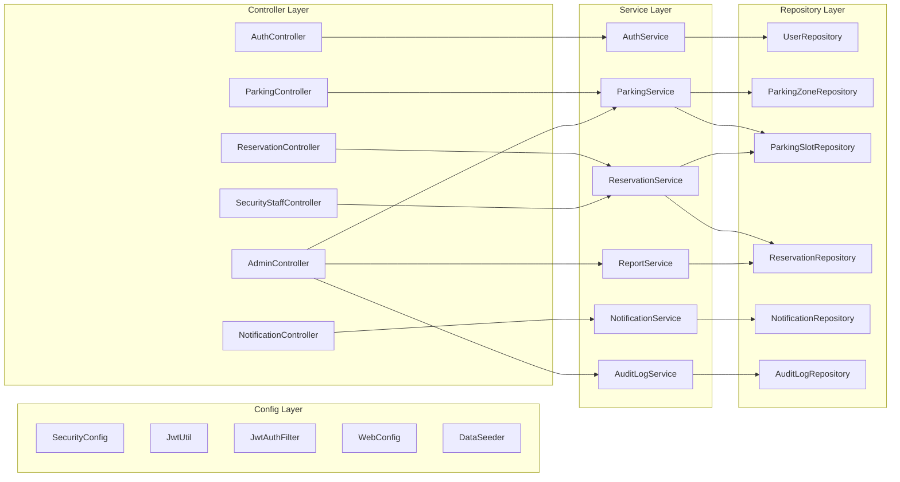

### Module Responsibilities

| Module | Controller | Service(s) | Responsibility |
|--------|-----------|------------|----------------|
| **Auth** | `AuthController` | `AuthService` | Registration, login, JWT issuance, profile & password management |
| **Parking** | `ParkingController` | `ParkingService` | Zone and slot browsing, availability queries |
| **Reservation** | `ReservationController` | `ReservationService` | Create/cancel/delete reservations, overlap detection, QR generation, auto-expiry |
| **Security Staff** | `SecurityStaffController` | `ReservationService` | QR verification, check-in/checkout, slot status updates |
| **Admin** | `AdminController` | `ParkingService`, `ReportService`, `AuditLogService` | Dashboard stats, zone CRUD, slot provisioning, reports, user listing, audit log |
| **Notification** | `NotificationController` | `NotificationService` | In-app notifications, unread counts, mark-as-read |
| **Audit** | — | `AuditLogService` | Cross-cutting action logging consumed by other services |

---

## 5. Data Model

### 5.1 Entity-Relationship Diagram

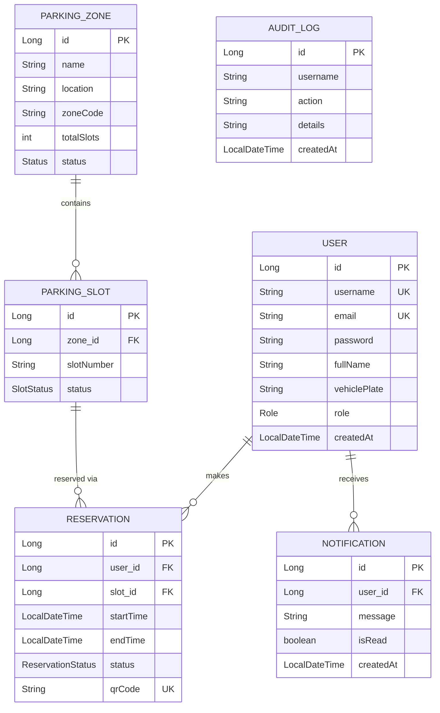

### 5.2 Enumerations

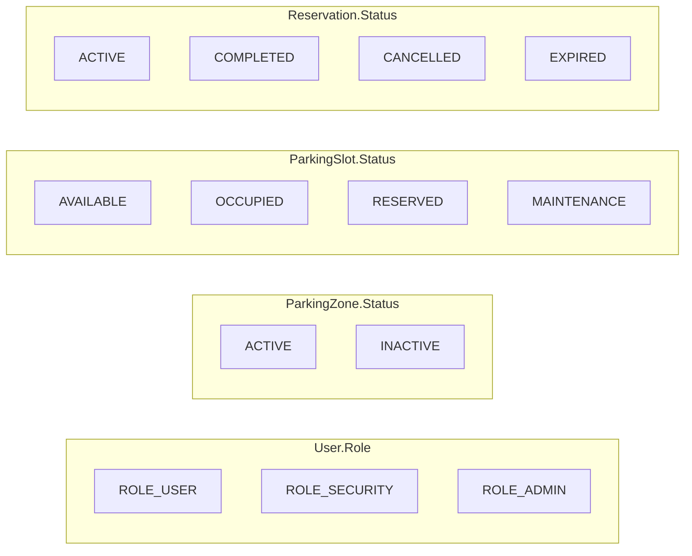

---

## 6. API Design

### 6.1 Endpoint Map

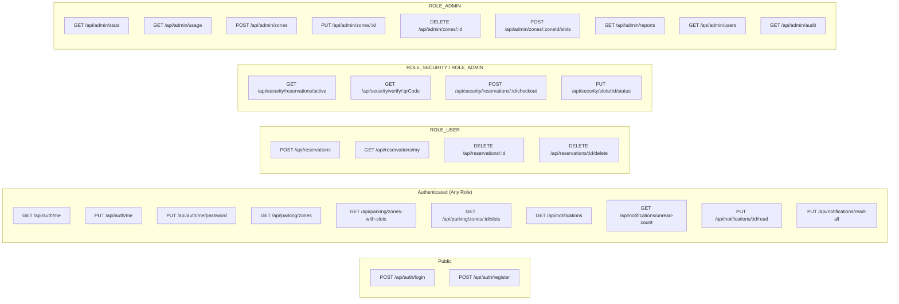

### 6.2 Endpoint Reference Table

| Method | Endpoint | Auth | Role | Description |
|--------|---------|------|------|-------------|
| POST | `/api/auth/login` | Public | — | Authenticate and receive JWT |
| POST | `/api/auth/register` | Public | — | Create new user account |
| GET | `/api/auth/me` | Yes | Any | Get current user profile |
| PUT | `/api/auth/me` | Yes | Any | Update profile details |
| PUT | `/api/auth/me/password` | Yes | Any | Change password |
| GET | `/api/parking/zones` | Yes | Any | List all active zones |
| GET | `/api/parking/zones-with-slots` | Yes | Any | Zones with slot details |
| GET | `/api/parking/zones/:id/slots` | Yes | Any | Slots for a specific zone |
| POST | `/api/reservations` | Yes | User | Create a reservation |
| GET | `/api/reservations/my` | Yes | User | List own reservations |
| DELETE | `/api/reservations/:id` | Yes | User | Cancel a reservation |
| DELETE | `/api/reservations/:id/delete` | Yes | User | Delete reservation record |
| GET | `/api/notifications` | Yes | Any | List user notifications |
| GET | `/api/notifications/unread-count` | Yes | Any | Count of unread notifications |
| PUT | `/api/notifications/:id/read` | Yes | Any | Mark notification as read |
| PUT | `/api/notifications/read-all` | Yes | Any | Mark all as read |
| GET | `/api/security/reservations/active` | Yes | Security/Admin | All active reservations |
| GET | `/api/security/verify/:qrCode` | Yes | Security/Admin | Verify QR code |
| POST | `/api/security/reservations/:id/checkout` | Yes | Security/Admin | Complete reservation checkout |
| PUT | `/api/security/slots/:id/status` | Yes | Security/Admin | Update slot status |
| GET | `/api/admin/stats` | Yes | Admin | Dashboard statistics |
| GET | `/api/admin/usage` | Yes | Admin | Zone usage analytics |
| POST | `/api/admin/zones` | Yes | Admin | Create a new zone |
| PUT | `/api/admin/zones/:id` | Yes | Admin | Update zone details |
| DELETE | `/api/admin/zones/:id` | Yes | Admin | Delete a zone |
| POST | `/api/admin/zones/:zoneId/slots` | Yes | Admin | Add slots to a zone |
| GET | `/api/admin/reports` | Yes | Admin | Date-range usage reports |
| GET | `/api/admin/users` | Yes | Admin | List all users |
| GET | `/api/admin/audit` | Yes | Admin | Paginated audit log |

---

## 7. Security Architecture

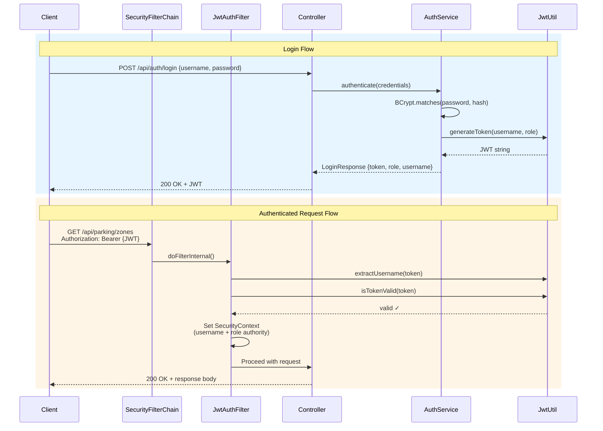

### Security Controls Summary

| Control | Implementation |
|---------|---------------|
| Password Hashing | BCrypt via `BCryptPasswordEncoder` |
| Token Format | JWT (HMAC-SHA signed) with `sub` (username) and `role` claims |
| Token Expiry | Configurable via `jwt.expiration` property / `JWT_EXPIRATION` env var |
| Secret Management | `jwt.secret` in properties, overridable via `JWT_SECRET` env var |
| Session Policy | Stateless (`SessionCreationPolicy.STATELESS`) |
| CORS | Wildcard origin on `/api/**` |
| Role Enforcement | Spring Security `requestMatchers` + role-based access rules |

---

## 8. Frontend Architecture

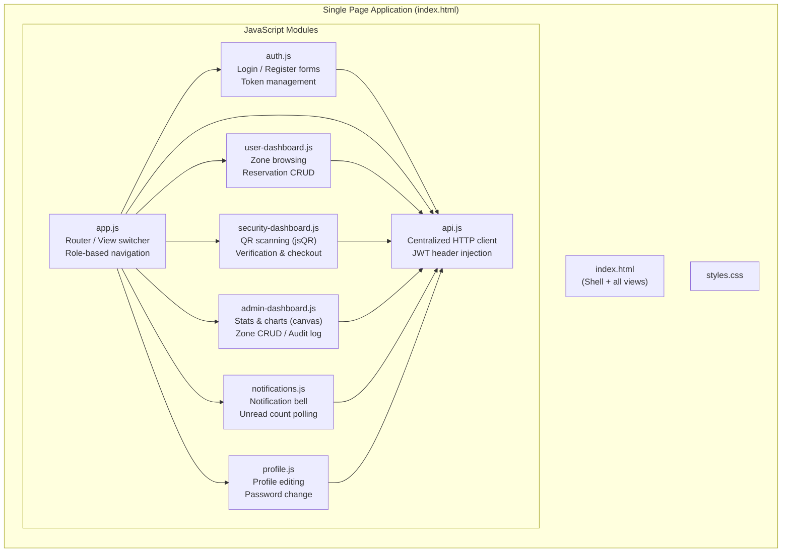

The frontend is a **framework-free SPA**. `app.js` reads the JWT role claim and toggles visibility of dashboard sections via DOM manipulation. All HTTP communication goes through `api.js` which injects the `Authorization: Bearer` header automatically.

---

## 9. Key Flows

### 9.1 Reservation Lifecycle

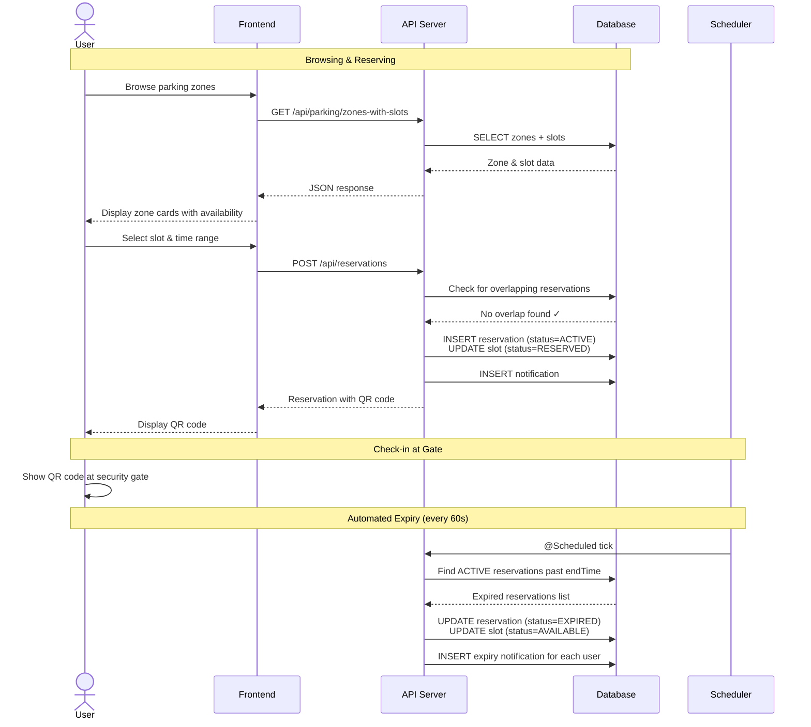

### 9.2 QR Verification & Checkout (Security Staff)

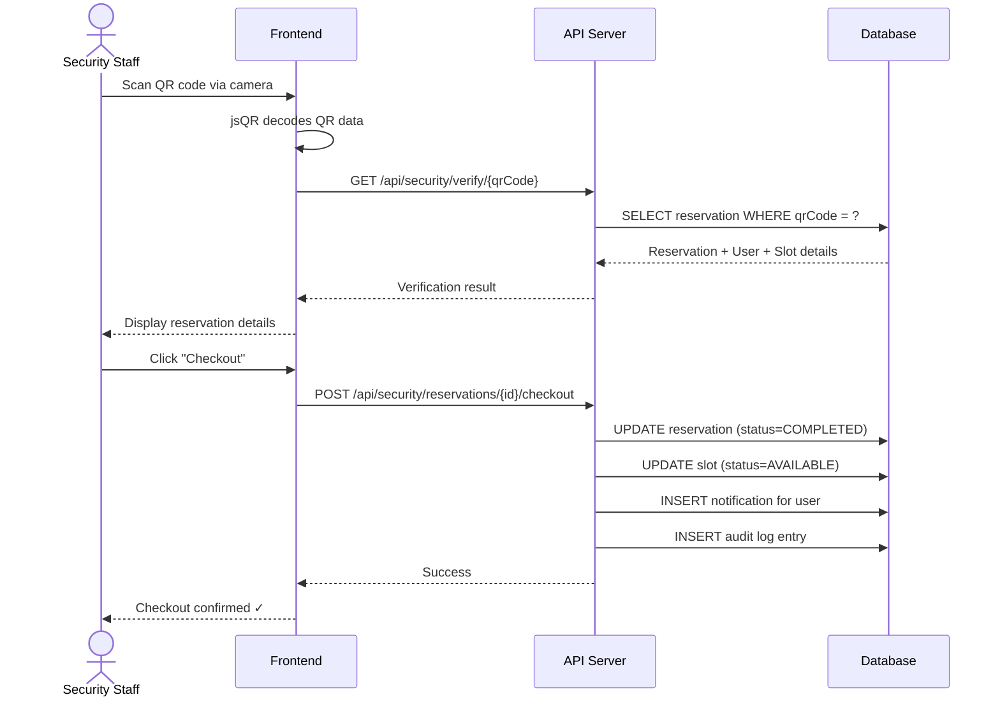

### 9.3 Reservation State Machine

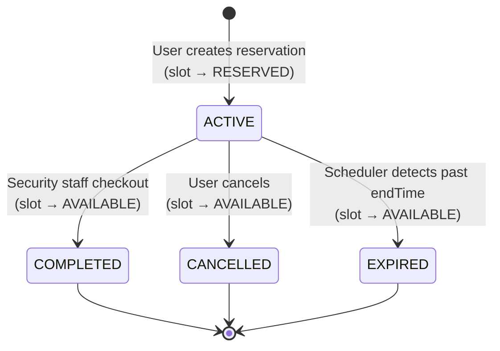

### 9.4 Slot State Machine

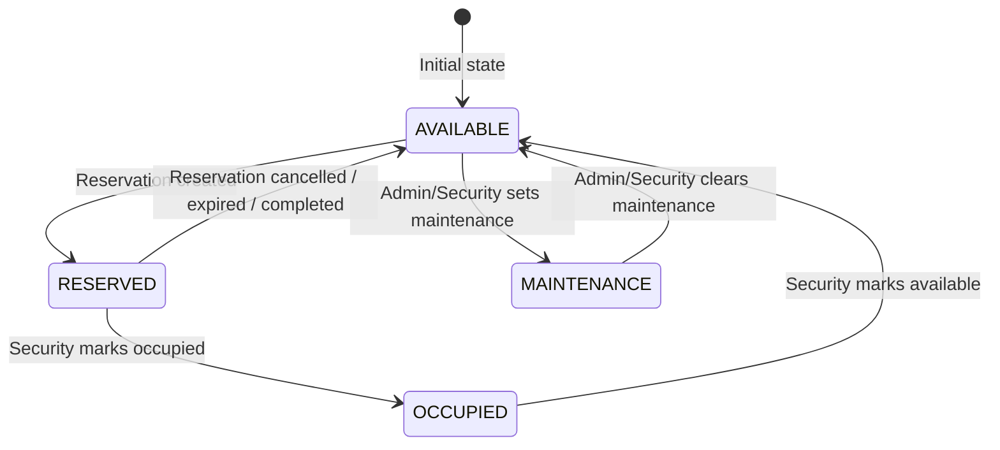

---

## 10. Deployment View

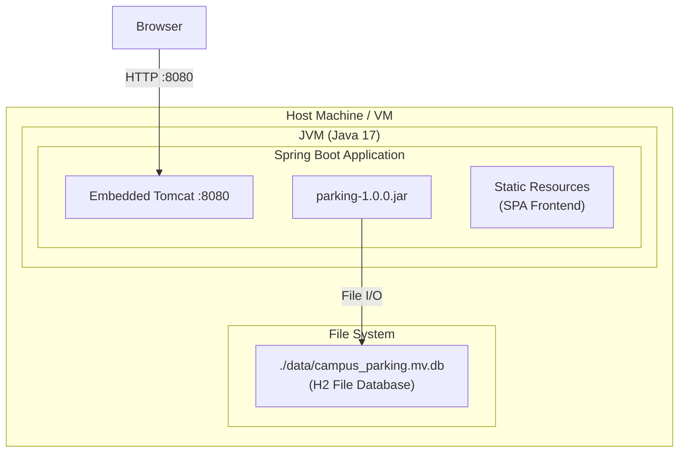

### Build & Run

```bash
# Build
mvn clean package -DskipTests

# Run
java -jar target/parking-1.0.0.jar

# With custom JWT secret (recommended for production)
JWT_SECRET=your-secure-secret JWT_EXPIRATION=86400000 java -jar target/parking-1.0.0.jar
```

### Demo Seed Data

On first startup (empty database), `DataSeeder` creates:

| Username | Password | Role |
|----------|----------|------|
| `admin` | `password123` | ROLE_ADMIN |
| `security` | `password123` | ROLE_SECURITY |
| `user` | `password123` | ROLE_USER |

Plus 3 parking zones with pre-configured slots and sample reservations.

---

## 11. Non-Functional Characteristics

| Aspect | Current State | Production Recommendation |
|--------|--------------|--------------------------|
| **Scalability** | Single-instance monolith, embedded H2 | Migrate to PostgreSQL/MySQL, containerize, add load balancer |
| **Availability** | Single process, no redundancy | Deploy multiple instances behind reverse proxy, add health checks |
| **Data Persistence** | H2 file-backed (dev-grade) | External RDBMS with backups and replication |
| **Schema Mgmt** | JPA `ddl-auto=update` | Adopt Flyway or Liquibase migrations |
| **Observability** | Audit logs in DB only | Add Spring Actuator, structured logging, external monitoring |
| **Security** | JWT + BCrypt (solid foundation) | Restrict CORS origins, externalize secrets (vault), add rate limiting |
| **Testing** | Unit tests for 2 services | Add integration tests, API tests, E2E tests |
| **CI/CD** | Manual build & run | Add GitHub Actions pipeline with test, build, deploy stages |

---

*Document generated for the Campus Parking Management System project.*
